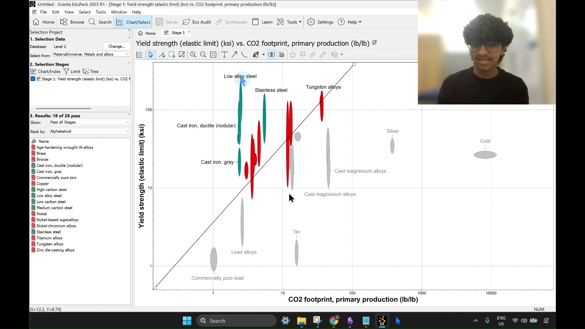
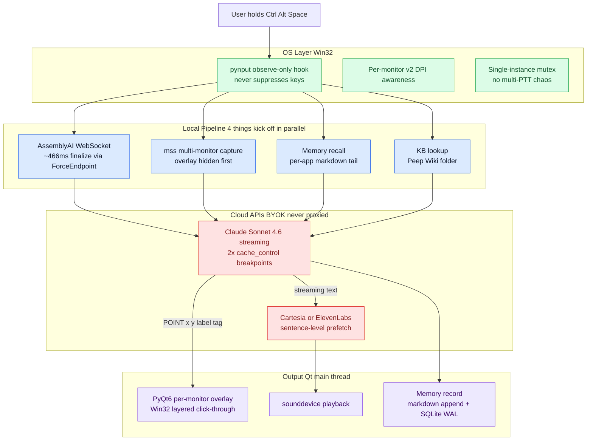

<p align="center">
  
</p>

<h1 align="center">Peep</h1>

<p align="center">
  A voice-driven, screen-aware AI buddy for Windows. Hold a hotkey, ask anything about whatever app you are looking at, and Peep talks back and points at the answer with a blue cursor.
</p>

<p align="center">
  <a href="https://github.com/MonishGosar/peep/actions/workflows/test.yml"></a>
  
  
  <a href="https://github.com/MonishGosar/peep/releases"></a>
</p>

<p align="center">
  <a href="https://github.com/MonishGosar/peep/releases/latest">Download</a> &middot;
  <a href="#what-it-does">What it does</a> &middot;
  <a href="#how-it-works">How it works</a> &middot;
  <a href="#engineering-decisions-worth-highlighting">Engineering</a> &middot;
  <a href="#faq">FAQ</a> &middot;
  <a href="#privacy">Privacy</a> &middot;
  <a href="#license-and-support">License</a>
</p>

> *"I just want to learn by doing."*
> Farza Majeed, on why he built the original Clicky

The #1 community request on [Farza's Clicky](https://github.com/farzaa/clicky) was a Windows version. I shipped it as Peep, plus the two features users asked for that the original does not have: persistent per-app memory, and a drop-in knowledge folder so Peep understands obscure or company-internal software Claude does not already know about.

<p align="center">
  <a href="https://youtu.be/ajIO6p7pR6M">
    
  </a>
</p>
<p align="center">
  <em>90 seconds. Me trying to navigate Granta EduPack for a class project — Peep knows my project, sees my screen, points at where to click.</em>
</p>

## What it does

You are working in some app. You hit a wall. You hold `Ctrl+Alt+Space`, ask a question out loud, release. Within about 1.7 seconds you hear the answer, and a blue cursor lands on the exact button or menu item you needed to click.

Three real ways people are using it:

- **Live chart analysis on TradingView.** *"What's this MACD divergence telling me?"* Peep reads the chart and walks you through the indicator, pointing at the relevant peaks.
- **Niche or company-internal software the AI does not know.** Drop a markdown file with the docs into `~/Documents/Peep Wiki/<app>.exe.md` and Peep becomes an expert. I do this for Granta EduPack, a materials-engineering tool I had to use for an SUTD class. Peep now points at things in EduPack like a TA who already read the manual.
- **Building a first app on Lovable, Bolt, Replit, or a similar AI-coding platform.** Don't know what a state hook is? Hit the hotkey, ask, Peep reads your editor and explains what is broken and where to click.

Everything runs through your own API keys. Nothing routes through a proxy server. See [Privacy](#privacy) for the specifics.

## Quick install

1. Download `Peep-Setup-v0.1.0.exe` from the [Releases](https://github.com/MonishGosar/peep/releases) page (~87 MB).
2. Run it. Windows SmartScreen will warn you (the EXE is unsigned for v0; SignPath OSS application is in flight). Click **More info** → **Run anyway**.
3. Launch Peep from the Start Menu. A modal asks for three API keys:
   - [Anthropic](https://console.anthropic.com/settings/keys) for Claude Sonnet 4.6 (vision and reasoning). v0.2.0+ users can pick **Ollama (local)** from the dropdown instead — see [FAQ](#faq) for the trade-offs.
   - [AssemblyAI](https://www.assemblyai.com/dashboard/signup) for Universal-3 streaming speech-to-text
   - [Cartesia](https://play.cartesia.ai/sign-in) for Sonic-3 voice output (or pick ElevenLabs from the dropdown)
4. Hit `Ctrl+Alt+Space`, ask something, release.

Free tier signups exist for all three cloud providers. Total cost for a typical 30-second interaction with the default Anthropic + AssemblyAI + Cartesia stack is around $0.016. Ollama (local) is free but slower and less accurate at pixel-pointing — see FAQ.

<p align="center">
  
  <br />
  <em>First-launch dialog. Three keys, one provider per category.</em>
</p>

## How it works



The hotkey listener observes Ctrl+Alt+Space without consuming the keys. On release, four things kick off in parallel: speech-to-text finalizes, the screen gets captured, per-app memory gets recalled, and a knowledge-base file gets looked up if one exists. Claude Sonnet 4.6 receives the screenshot plus the transcript plus the memory plus the KB, and streams a response. Sentences flush to the TTS provider as soon as a `.!?` boundary is hit, so the user starts hearing audio while Claude is still generating. A `[POINT:x,y:label]` tag in the response drives a per-monitor PyQt6 overlay to point at the exact pixel.

## Engineering decisions worth highlighting

The interesting parts. Each of these is a problem I hit, the gotcha I had to figure out, and the measured win.

<details>
<summary><strong>1. Sub-2s first-audible-word despite three sequential APIs</strong> — parallel kick-off + sentence streaming + Cartesia double-buffer. ~3.7s naive → ~1.7s measured. Click to expand.</summary>

The naive pipeline is hotkey → STT (wait) → screenshot (wait) → Claude vision (wait) → TTS (wait). That is roughly 3.7 seconds of latency for a one-sentence response. Unusable.

What fixed it:

- **Parallel kick-off.** STT, screen capture, memory recall, and KB lookup all start the moment the user releases the hotkey. They run on separate worker threads and feed Claude as soon as all four finish. Capture is the slowest at ~50ms, so the wall-clock cost is roughly 50ms instead of the sum.
- **Sentence-level streaming.** The Claude response is consumed token by token. As soon as a `.!?` boundary lands, that sentence gets flushed to the TTS provider. By the time Claude generates sentence three, sentence one is already playing.
- **Cartesia "Option B" HTTP double-buffer.** Two background threads on the TTS side: one prefetches the next sentence while the other plays the current one. Inter-sentence gaps drop to roughly zero. Implementation is in [`tts.py`](tts.py) (`CartesiaSonicTTS._prefetch_worker` and `_playback_worker`).

Measured first-audible-word for a multi-sentence response: about 1.7 seconds. For a single-sentence response it is closer to 4-6 seconds because the first-sentence TTFB dominates and there is nothing to overlap.

```text
NAIVE SERIAL (~3.7s)                          OPTIMIZED (~1.7s)

t=0     STT finalize       (500ms)            t=0     STT finalize       (466ms)  ─┐
        │                                             │                            │
t=500   Screen capture     (50ms)             t=0     Screen capture     (50ms)    │
        │                                             │                            │ parallel
t=550   Claude vision FULL (2000ms)           t=0     Memory recall      (10ms)    │ kick-off
        │                                             │                            │
t=2550  TTS first sentence (1000ms)           t=0     KB lookup          (10ms)   ─┘
        │                                             │
t=3550  🔊  first audible word                t=466   Claude streams s1  (800ms)
                                                      │
                                              t=1266  TTS prefetch s1    (200ms)
                                                      │
                                              t=1466  🔊  first audible word


Three wins stacked:
  (1) parallel kick-off  → 4 tasks start at t=0, wait for slowest (STT 466ms), not the sum
  (2) sentence streaming → TTS begins on sentence 1 while Claude generates sentence 2+
  (3) Option B buffer    → prefetch + playback worker threads, inter-sentence gap ≈ 0
```

</details>

<details>
<summary><strong>2. Win32 layered click-through overlay, per-monitor DPI-aware</strong> — one QWidget per physical screen sidesteps Qt 6's mixed-DPI gotcha; ctypes flags applied AFTER show(). Click to expand.</summary>

The blue cursor that points at things has to do four things at once:
- always on top
- click-through (mouse events pass to the app underneath)
- never steal focus
- correct pixel position on mixed-DPI multi-monitor setups (a 4K external monitor at 200% scaling next to a 1080p laptop screen at 100%)

Qt 6 has a known gotcha here. If you make one giant overlay that spans the virtual desktop, it renders at the wrong size on at least one of the monitors. The fix is to spawn one `QWidget` per physical screen and route the pointer to the correct one via `QGuiApplication.screens()` metadata. See [`overlay.py`](overlay.py).

The click-through behavior comes from Win32 layered-window flags applied via `ctypes` (`WS_EX_LAYERED | WS_EX_TRANSPARENT | WS_EX_TOPMOST | WS_EX_NOACTIVATE | WS_EX_TOOLWINDOW`). They have to be applied AFTER `show()`, OR'd in (never overwritten), and followed by `SetWindowPos(SWP_FRAMECHANGED)`. Get any of those wrong and the overlay either disappears, eats clicks, or starts blocking the taskbar.

</details>

<details>
<summary><strong>3. A hotkey that does not break your typing</strong> — observe-only pynput Listener (suppress=False is load-bearing); three-step pivot to find an Excel-safe combo. Click to expand.</summary>

`pynput.Listener(suppress=False)` is observe-only. It sees keypresses, the OS still delivers them to whatever app is focused. This is load-bearing. Setting `suppress=True` installs a `WH_KEYBOARD_LL` hook that globally blocks every keystroke from reaching anything. Your typing breaks system-wide. Do not do this.

The hotkey choice itself was a three-step pivot:

- **Alt+Space.** Conflicts with Windows window menu and Copilot. Killed.
- **Ctrl+Shift+Space.** Conflicts with Excel's "Select entire worksheet" binding. Because the listener is observe-only, Excel ALSO receives the keypress and wipes your selection every time you invoke Peep. Killed during the Excel demo.
- **Ctrl+Alt+Space.** No known conflicts. Ergonomic enough. Three fingers but all on the left side. Shipped.

A clean solution for Alt+Space exists: Win32 `RegisterHotKey` claims the combo at the OS level so other apps never see it. That is a Phase 1.5 drop-in replacement.

</details>

<details>
<summary><strong>4. Multi-provider TTS via progressive-disclosure UX</strong> — 3-category dropdown (LLM/STT/TTS) instead of 6 password fields; ElevenLabsTTS mirrors Cartesia with 3 deliberate divergences. Click to expand.</summary>

The naive way to add a second TTS provider is to add another field to the settings dialog. Three required keys becomes four. Then you add a second STT provider and it becomes five. By the time you have one option per category you are at six required password fields on a first-launch dialog. That is well past the documented onboarding-abandonment cliff.

What shipped instead: three category rows (LLM / STT / TTS), each with a dropdown for provider plus a single API key field for whichever provider is currently selected. Switch the dropdown, the field rebinds to that provider's keyring slot. One key visible at a time, vendor flexibility preserved.

The `ElevenLabsTTS` class mirrors `CartesiaSonicTTS` Option B prefetch+playback architecture verbatim with three deliberate differences:

- `_generate_response` calls `client.text_to_speech.stream()` which returns an `Iterator[bytes]` directly, instead of Cartesia's `generate(...)` which blocks for the full body and then exposes `.iter_bytes()`.
- `_play_response` converts each int16 PCM chunk to float32 inline (`np.frombuffer(chunk, np.int16).astype(np.float32) / 32768.0`). Cartesia emits float32 directly so no conversion is needed.
- `stop()` is 5-pronged instead of 6-pronged. The ElevenLabs SDK does not expose a `response.close()` method, so cancellation is just "set the cancel event, break the for-loop, let Python GC close the underlying httpx connection."

Sample rate is per-provider (Cartesia 44.1kHz, ElevenLabs 22.05kHz) because ElevenLabs free tier only ships 22.05kHz PCM. Each subclass owns its own `sample_rate` attribute and constructs its own `sounddevice.OutputStream`. Switching providers in the dialog requires a Peep restart but no code change.

</details>

<details>
<summary><strong>5. Single-instance mutex preventing the multi-PTT chaos</strong> — observe-only hook means N processes = N overlapping voices; canonical Win32 named-mutex (Spotify/Slack/Discord pattern) acquired before QApplication. Click to expand.</summary>

A user reported double-clicking the installed Start Menu shortcut and seeing three blue cursor icons stacked in the system tray. Worse, every Ctrl+Alt+Space press triggered three overlapping voice responses to the same question.

The cause: `pynput.Listener(suppress=False)` is observe-only, which means multiple Peep processes coexist as independent `WH_KEYBOARD_LL` hooks. Windows broadcasts every keypress to every installed hook. N processes means N parallel STT → Claude → TTS pipelines.

The fix is the canonical Win32 named-mutex pattern that Spotify, Slack, Discord, and Raycast all use: acquire a mutex named `Local\\Peep-SingleInstance-v1` BEFORE constructing the QApplication. First instance gets the mutex. Second instance sees `ERROR_ALREADY_EXISTS` (183), shows a `MessageBoxW` directing the user to the existing tray icon, and exits with `sys.exit(0)`.

Three ctypes details that all matter:

- `kernel32.CreateMutexW.restype = wintypes.HANDLE` to prevent x64 HANDLE truncation. Without explicit `restype`, ctypes defaults to `c_int` which is 32-bit, which silently corrupts 64-bit handles.
- `bInitialOwner=False`. We want existence-as-a-flag, not ownership semantics. `True` would make the first instance pointlessly own a mutex it never releases.
- `Local\\` namespace prefix. Per-logon-session, not per-machine. So two different Windows users on the same RDP host can each run their own Peep.

Implementation in [`app.py`](app.py).

</details>

<details>
<summary><strong>6. Markdown memory and a drop-in knowledge folder</strong> — two stores, plain-text .md per app, no vector DB; auto-learned memory tail + user-uploadable KB at second cache_control breakpoint. Click to expand.</summary>

Two stores, both human-readable markdown, no vector DB.

**Auto-learned memory.** One `.md` file per app at `~/.peep/memory/<app>.exe.md`. Every interaction appends a structured block (timestamp, app, window title, transcript, response, pointer target). On the next interaction in the same app, the last 1500 characters get tail-truncated and injected into Claude's user-message text block. Not the system prompt. The transparency contract is "you can `cat EXCEL.EXE.md` and read everything Peep knows about you."

**User-uploadable KB.** One `.md` file per app at `~/Documents/Peep Wiki/<app>.exe.md`. Up to 60K characters get injected as a second `cache_control` breakpoint in the system prompt, marked as "authoritative reference for this app." This is how you teach Peep niche or company-internal software Claude has never seen.

<p align="center">
  
  <br />
  <em>The memory folder viewed in Obsidian — one node per app Peep has been used in. Each node is a plain-text Markdown file you can read or edit.</em>
</p>

The pattern is in the lineage of [Andrej Karpathy's LLM Wiki idea](https://gist.github.com/karpathy/442a6bf555914893e9891c11519de94f). Deliberately simplified for runtime context injection rather than long-form synthesis.

</details>

## FAQ

<details>
<summary><strong>Does Ollama work?</strong> — yes, via a two-stage grid locator. ~30-50px accuracy vs Claude's ~5px. Click to expand for setup steps.</summary>

Select **Ollama (local)** from the LLM dropdown in Settings. Default Ollama host is `http://localhost:11434`. Default vision model is `llava:7b` — it works on every Ollama version with vision support. Peep also exposes a model picker in Settings so you can switch to `llama3.2-vision`, `qwen2.5-vl`, `llava-llama3`, or type any custom model you've pulled.

`llama3.2-vision` is more accurate than `llava:7b` but uses the `mllama` architecture which needs Ollama ≥0.4.x. If you pick it on an older Ollama, Peep pops up a warning in the Settings dialog before saving — you can override and save anyway, or pick a compatible model.

Local vision models can't return precise pixel coordinates directly, so Peep uses a **two-stage grid** when pointing: it draws a numbered 12×8 grid on the screenshot, asks the model "which cell?", then zooms into that area with a 6×6 sub-grid and asks again. Accuracy is roughly ±30-50 px vs Claude's ~5 px. Plenty for buttons, menus, links, icons. Worse for tightly-packed UIs (small text, dense toolbars).

**Prerequisites:**

1. Install Ollama from [ollama.com/download](https://ollama.com/download)
2. Pull a vision model: `ollama pull llava:7b` (smaller, ~4.5 GB) or `ollama pull llama3.2-vision` (more accurate, ~7.9 GB, needs Ollama ≥0.4.x)
3. Make sure Ollama is running: `ollama serve` (usually auto-starts on install)
4. In Peep: open Settings → LLM dropdown → switch to **Ollama (local)** → optionally pick a different model from the model dropdown → save → restart Peep

The grid-locator pattern was directly inspired by [Bitshank-2338/clicky-windows](https://github.com/Bitshank-2338/clicky-windows) (MIT-licensed). Original implementation lives in their `ai/universal_locator.py`.

</details>

## Privacy

Nothing leaves your machine, except the things you explicitly send to your own APIs.

- API keys live in Windows Credential Manager via DPAPI per-user encryption. Better than plaintext `.env` but does not protect against malware running as your user account.
- Screenshots, voice, transcripts, and Claude responses go directly from your machine to Anthropic / AssemblyAI / Cartesia or ElevenLabs using YOUR keys. No proxy, no logging server, nothing routes through anyone else.
- Per-app memory and the KB folder live on your local disk in plain markdown. You can read them, edit them, delete them.

This is the BYOK model from day 1, by deliberate contrast with the upstream Clicky which uses a Cloudflare Worker proxy that holds the API keys server-side.

## Acknowledgments

Built on top of the original [Clicky by Farza Majeed](https://github.com/farzaa/clicky), which is the macOS version this is a Windows port of. The memory pattern is in the lineage of [Andrej Karpathy's LLM Wiki idea](https://gist.github.com/karpathy/442a6bf555914893e9891c11519de94f), simplified to per-app files for the runtime context-injection use case rather than long-form synthesis.

## License and support

[MIT](LICENSE). Personal project. PRs welcome but I make no SLA on review timing. If you find a bug, please file an issue and attach the contents of `~/.peep/debug/` from a recent interaction so I can see what happened.
