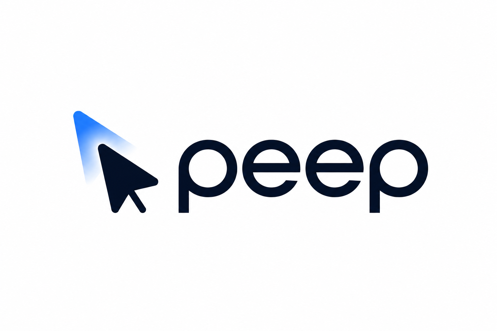
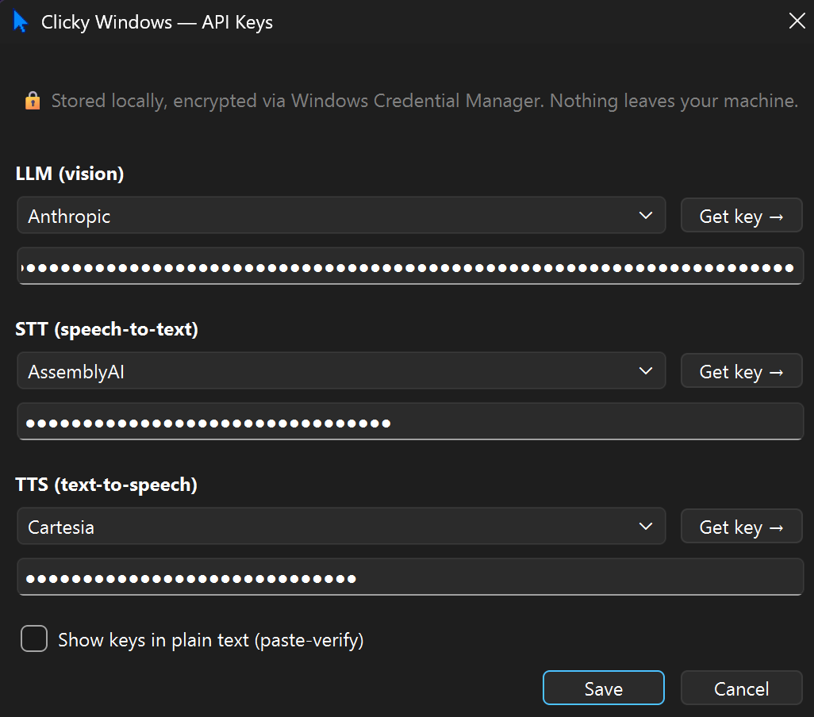
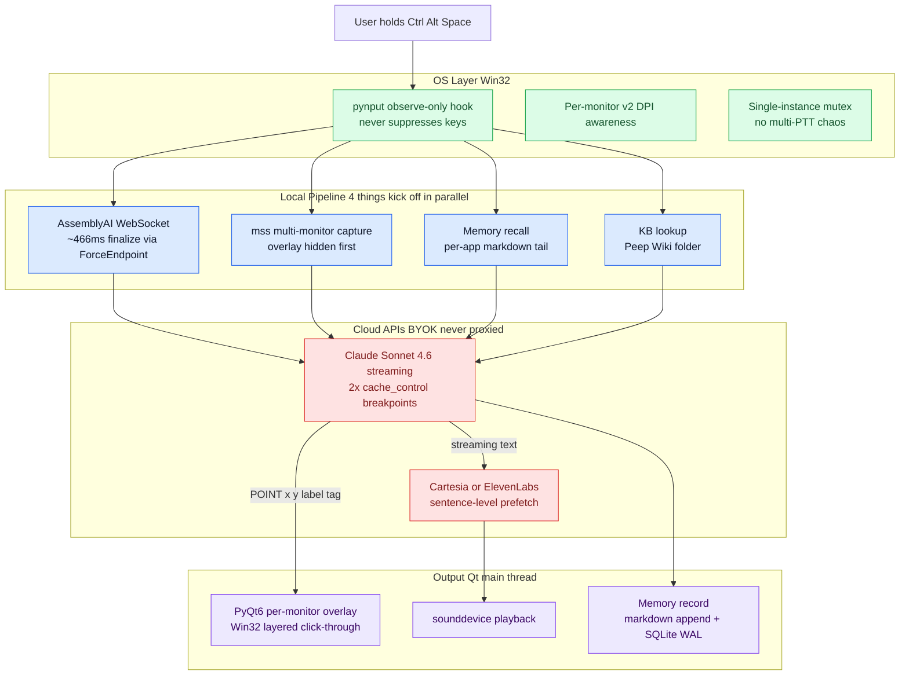
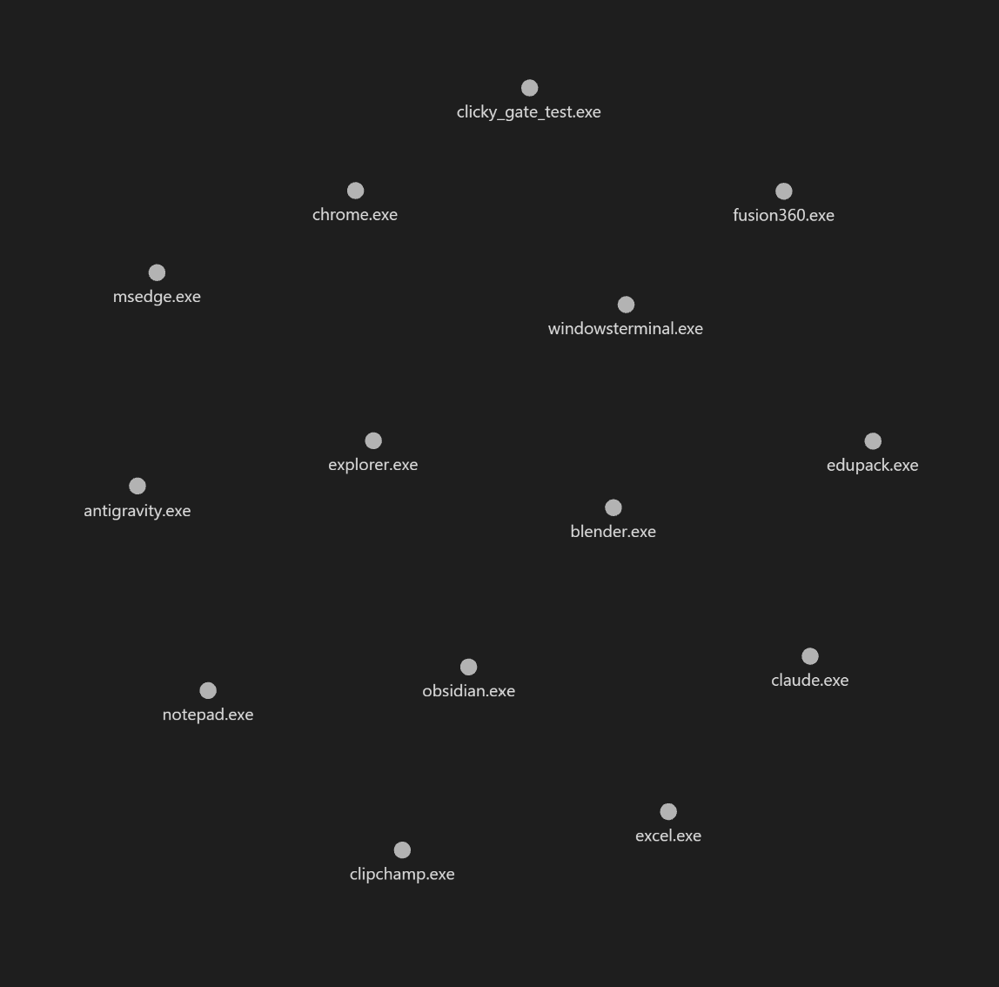

<p align="center">
  
</p>

<h1 align="center">Peep</h1>

<p align="center">
  A voice-driven, screen-aware AI buddy for Windows. Hold a hotkey, ask anything about whatever app you're looking at, and Peep talks back — and points at the answer with a blue cursor.
</p>

<p align="center">
  <a href="https://github.com/MonishGosar/peep/actions/workflows/test.yml"></a>
  
  
  <a href="https://github.com/MonishGosar/peep/releases"></a>
</p>

<p align="center">
  <a href="https://github.com/MonishGosar/peep/releases/latest">Download</a> &middot;
  <a href="#what-it-does">What it does</a> &middot;
  <a href="#how-it-works">How it works</a> &middot;
  <a href="#engineering-decisions-worth-highlighting">Engineering</a> &middot;
  <a href="#faq">FAQ</a> &middot;
  <a href="#privacy">Privacy</a> &middot;
  <a href="#license-and-support">License</a>
</p>

## What it does

You're stuck in some app. You hold `Ctrl+Alt+Space`, ask out loud, release. Within about 1.7 seconds you hear the answer, and a blue cursor lands on the exact button or menu item you need to click.

Three real ways people are using it:

- **Live chart analysis on TradingView.** *"What's this MACD divergence telling me?"* Peep reads the chart and walks you through the indicator, pointing at the relevant peaks.
- **Niche or company-internal software the AI doesn't know.** Drop a markdown file with the docs into `~/Documents/Peep Wiki/<app>.exe.md` and Peep becomes an expert — pointing at things like a TA who already read the manual.
- **Building your first app on Lovable, Bolt, or Replit.** Don't know what a state hook is? Hit the hotkey, ask, Peep reads your editor and explains what's broken and where to click.

Everything runs through your own API keys. Nothing routes through a proxy. See [Privacy](#privacy) for specifics.

## Quick install

1. Download `Peep-Setup-v0.2.1.exe` from the [Releases](https://github.com/MonishGosar/peep/releases) page (~87 MB).
2. Run it. Windows SmartScreen will warn you (unsigned EXE). Click **More info** → **Run anyway**.
3. Launch Peep from the Start Menu. A modal asks for three API keys:
   - [Anthropic](https://console.anthropic.com/settings/keys) for Claude Sonnet 4.6 (vision + reasoning). You can also pick **Ollama (local)** from the dropdown — see [FAQ](#faq) for trade-offs.
   - [AssemblyAI](https://www.assemblyai.com/dashboard/signup) for Universal-3 streaming speech-to-text
   - [Cartesia](https://play.cartesia.ai/sign-in) for Sonic-3 voice output (or pick ElevenLabs from the dropdown)
4. Hit `Ctrl+Alt+Space`, ask something, release.

Free tiers exist for all three providers. Typical 30-second interaction costs ~$0.016. Ollama is free but slower and less accurate at pixel-pointing — see FAQ.

<p align="center">
  
  <br />
  <em>First-launch dialog. Three keys, one provider per category.</em>
</p>

## How it works



The hotkey listener observes Ctrl+Alt+Space without consuming the keys. On release, four things kick off in parallel: speech-to-text finalizes, the screen gets captured, per-app memory is recalled, and a knowledge-base file gets looked up if one exists. Claude Sonnet 4.6 receives the screenshot, transcript, memory, and KB — and streams a response. Sentences flush to the TTS provider as soon as a `.!?` boundary is hit, so you start hearing audio while Claude is still generating. A `[POINT:x,y:label]` tag drives a per-monitor PyQt6 overlay to point at the exact pixel.

## Engineering decisions worth highlighting

<details>
<summary><strong>1. Sub-2s first-audible-word despite three sequential APIs</strong> — parallel kick-off + sentence streaming + Cartesia double-buffer. ~3.7s naive → ~1.7s measured. Click to expand.</summary>

The naive pipeline is hotkey → STT (wait) → screenshot (wait) → Claude vision (wait) → TTS (wait). Roughly 3.7 seconds. Unusable.

What fixed it:

- **Parallel kick-off.** STT, screen capture, memory recall, and KB lookup all start the moment the user releases the hotkey. They run on separate worker threads. Capture is the slowest at ~50ms, so wall-clock cost is ~50ms instead of the sum.
- **Sentence-level streaming.** The Claude response is consumed token by token. As soon as a `.!?` boundary lands, that sentence flushes to TTS. By the time Claude generates sentence three, sentence one is already playing.
- **Cartesia "Option B" HTTP double-buffer.** Two background threads: one prefetches the next sentence while the other plays the current one. Inter-sentence gaps drop to roughly zero. Implementation in [`audio/tts.py`](audio/tts.py).

Measured first-audible-word for a multi-sentence response: ~1.7s.

```text
NAIVE SERIAL (~3.7s)                          OPTIMIZED (~1.7s)

t=0     STT finalize       (500ms)            t=0     STT finalize       (466ms)  ─┐
        │                                             │                            │
t=500   Screen capture     (50ms)             t=0     Screen capture     (50ms)    │
        │                                             │                            │ parallel
t=550   Claude vision FULL (2000ms)           t=0     Memory recall      (10ms)    │ kick-off
        │                                             │                            │
t=2550  TTS first sentence (1000ms)           t=0     KB lookup          (10ms)   ─┘
        │                                             │
t=3550  🔊  first audible word                t=466   Claude streams s1  (800ms)
                                                      │
                                              t=1266  TTS prefetch s1    (200ms)
                                                      │
                                              t=1466  🔊  first audible word


Three wins stacked:
  (1) parallel kick-off  → 4 tasks at t=0, wait for slowest (STT 466ms)
  (2) sentence streaming → TTS begins on sentence 1 while Claude generates 2+
  (3) Option B buffer    → prefetch + playback threads, inter-sentence gap ≈ 0
```

</details>

<details>
<summary><strong>2. Win32 layered click-through overlay, per-monitor DPI-aware</strong> — one QWidget per physical screen sidesteps Qt 6's mixed-DPI gotcha; ctypes flags applied AFTER show(). Click to expand.</summary>

The blue cursor has to be always-on-top, click-through, focus-stealing-never, and pixel-correct on mixed-DPI setups. Qt 6 has a gotcha: one giant overlay spanning the virtual desktop renders at the wrong size on at least one monitor. Fix: one `QWidget` per physical screen, routed via `QGuiApplication.screens()`. See [`ui/overlay.py`](ui/overlay.py).

Click-through comes from Win32 layered-window flags via `ctypes` (`WS_EX_LAYERED | WS_EX_TRANSPARENT | WS_EX_TOPMOST | WS_EX_NOACTIVATE | WS_EX_TOOLWINDOW`). They must be applied AFTER `show()`, OR'd in (never overwritten), then followed by `SetWindowPos(SWP_FRAMECHANGED)`. Get any of those wrong and the overlay disappears, eats clicks, or blocks the taskbar.

</details>

<details>
<summary><strong>3. A hotkey that doesn't break your typing</strong> — observe-only pynput Listener (suppress=False is load-bearing); three-step pivot to find an Excel-safe combo. Click to expand.</summary>

`pynput.Listener(suppress=False)` is observe-only — it sees keypresses but the OS still delivers them to whatever app is focused. `suppress=True` installs a `WH_KEYBOARD_LL` hook that globally blocks every keystroke. Do not use it.

Hotkey pivot:
- **Alt+Space** — conflicts with Windows window menu and Copilot. Killed.
- **Ctrl+Shift+Space** — conflicts with Excel's "Select entire worksheet." Because the listener is observe-only, Excel also receives the keypress and wipes your selection. Killed.
- **Ctrl+Alt+Space** — no known conflicts. Three fingers, all on the left side. Shipped.

</details>

<details>
<summary><strong>4. Multi-provider TTS via progressive-disclosure UX</strong> — 3-category dropdown instead of 6 password fields. Click to expand.</summary>

Three category rows (LLM / STT / TTS), each with a provider dropdown and a single API key field for whichever provider is selected. Switch the dropdown, the field rebinds to that provider's keyring slot. One key visible at a time, full vendor flexibility.

`ElevenLabsTTS` mirrors `CartesiaSonicTTS` Option B prefetch+playback architecture with three deliberate differences:
- `_generate_response` calls `client.text_to_speech.stream()` which returns an `Iterator[bytes]` directly.
- `_play_response` converts int16 PCM to float32 inline. Cartesia emits float32 directly.
- `stop()` is 5-pronged vs 6. ElevenLabs has no `response.close()`, so cancellation just sets the cancel event and breaks the loop.

</details>

<details>
<summary><strong>5. Single-instance mutex preventing multi-PTT chaos</strong> — canonical Win32 named-mutex acquired before QApplication. Click to expand.</summary>

Without this, double-clicking the Start Menu shortcut spawns multiple Peep processes — each an independent `WH_KEYBOARD_LL` hook. Every keypress triggers N parallel STT → Claude → TTS pipelines. N overlapping voices.

Fix: acquire `Local\\Peep-SingleInstance-v1` BEFORE constructing QApplication. Second instance sees `ERROR_ALREADY_EXISTS` (183), shows a MessageBox directing to the existing tray icon, and exits. Three ctypes details: explicit `restype = wintypes.HANDLE` to prevent x64 truncation, `bInitialOwner=False`, and `Local\\` namespace for per-session isolation. See [`app.py`](app.py).

</details>

<details>
<summary><strong>6. Markdown memory and a drop-in knowledge folder</strong> — two plain-text stores, no vector DB. Click to expand.</summary>

**Auto-learned memory.** One `.md` file per app at `~/.peep/memory/<app>.exe.md`. Every interaction appends a structured block (timestamp, app, window title, transcript, response, pointer target). On the next interaction, the last 1500 characters get injected into Claude's user-message. The transparency contract: you can `cat EXCEL.EXE.md` and read everything Peep knows.

**User-uploadable KB.** One `.md` file per app at `~/Documents/Peep Wiki/<app>.exe.md`. Up to 60K characters injected as a `cache_control` breakpoint in the system prompt. This is how you teach Peep niche or company-internal software.

<p align="center">
  
  <br />
  <em>Memory folder in Obsidian — one node per app. Each node is a plain markdown file you can read or edit.</em>
</p>

</details>

## FAQ

<details>
<summary><strong>Does Ollama work?</strong> — yes, via a two-stage grid locator. ~30-50px accuracy vs Claude's ~5px. Click to expand.</summary>

Select **Ollama (local)** from the LLM dropdown. Default host `http://localhost:11434`, default model `llava:7b`. Peep exposes a model picker so you can switch to `llama3.2-vision`, `qwen2.5-vl`, or any model you've pulled.

`llama3.2-vision` needs Ollama ≥0.4.x. If you pick it on an older version, Peep shows a warning before saving.

Local models can't return precise pixel coordinates, so Peep uses a **two-stage grid**: 12×8 grid → ask "which cell?" → zoom to 6×6 sub-grid → ask again. Accuracy ~±30-50px vs Claude's ~5px. Fine for buttons and menus, worse for dense toolbars.

**Setup:**
1. Install Ollama from [ollama.com/download](https://ollama.com/download)
2. `ollama pull llava:7b` (~4.5 GB) or `ollama pull llama3.2-vision` (~7.9 GB, needs ≥0.4.x)
3. `ollama serve`
4. In Peep: Settings → LLM → Ollama (local) → pick model → save → restart

</details>

## Privacy

Nothing leaves your machine except what you explicitly send to your own APIs.

- API keys live in Windows Credential Manager via DPAPI per-user encryption.
- Screenshots, voice, transcripts, and responses go directly from your machine to Anthropic / AssemblyAI / Cartesia or ElevenLabs using YOUR keys. No proxy, no logging server.
- Per-app memory and the KB folder are plain markdown on your local disk. Read them, edit them, delete them.

## License and support

[MIT](LICENSE). PRs welcome. If you find a bug, file an issue and attach `~/.peep/debug/` from a recent interaction.
